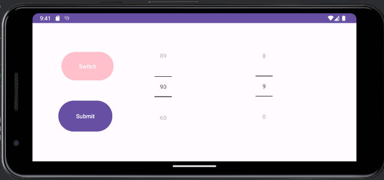

# weight-tracking-app

A simple Android app to submit numbers to a remote HTTPS server and store them as CSV.

Mount an old Android phone above your scales and start tracking.

# Android app

Build the project with Android Studio: [android/](android/)

Update the [MainActivity.java](https://github.com/antnks/weight-tracking-app/blob/main/android/app/src/main/java/com/github/antnks/android/counter/MainActivity.java#L68) and put your server address.

Switch button switches profiles. Currently supports two profiles (blue and pink colors).
Upload sends data to php script on the server.

# Server php script

Sample php script to receive data and store it as csv: [php/](php/)

# Python graph

Sample pyhton script to visualize csv as graph: [python/](python/)

# Bash dropbox upload

Sample bash script to upload graph to dropbox: [bash/](bash/)

